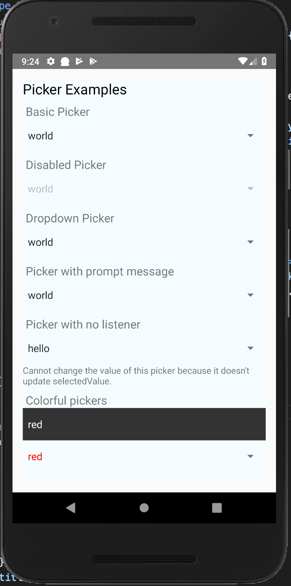
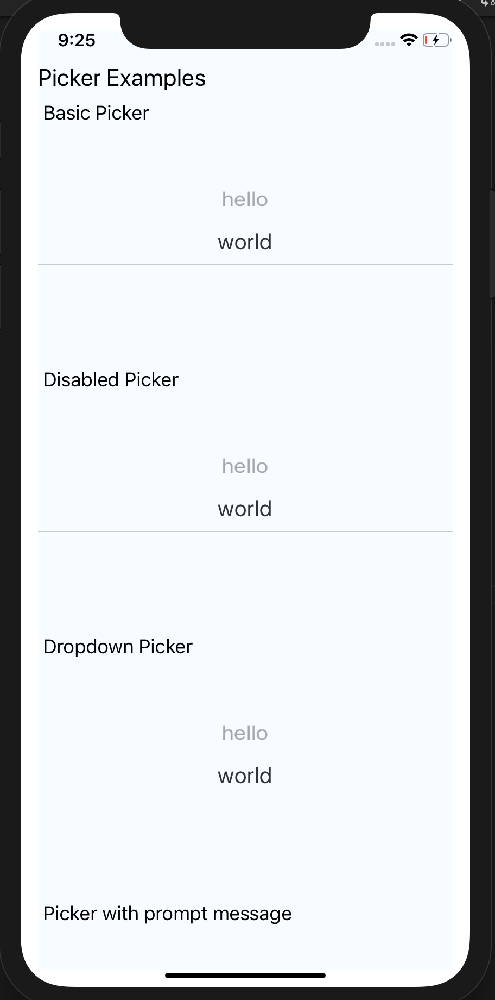
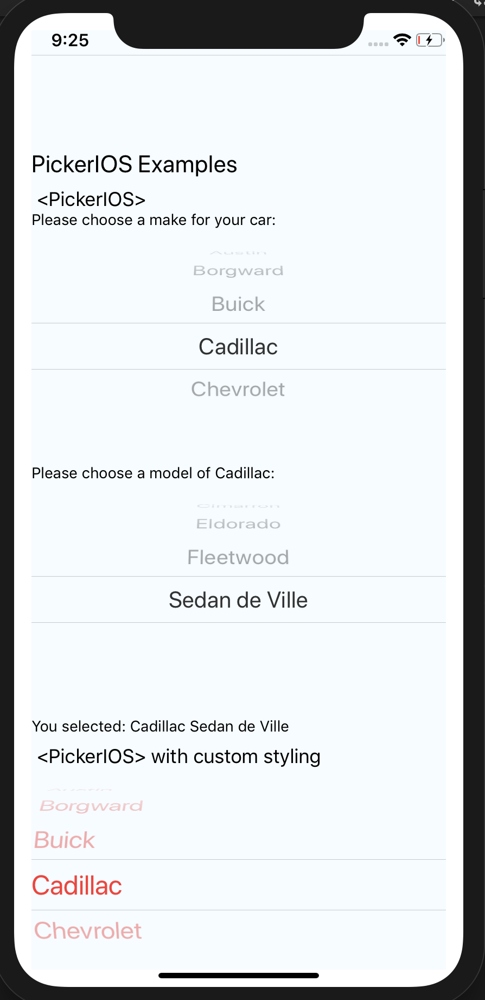
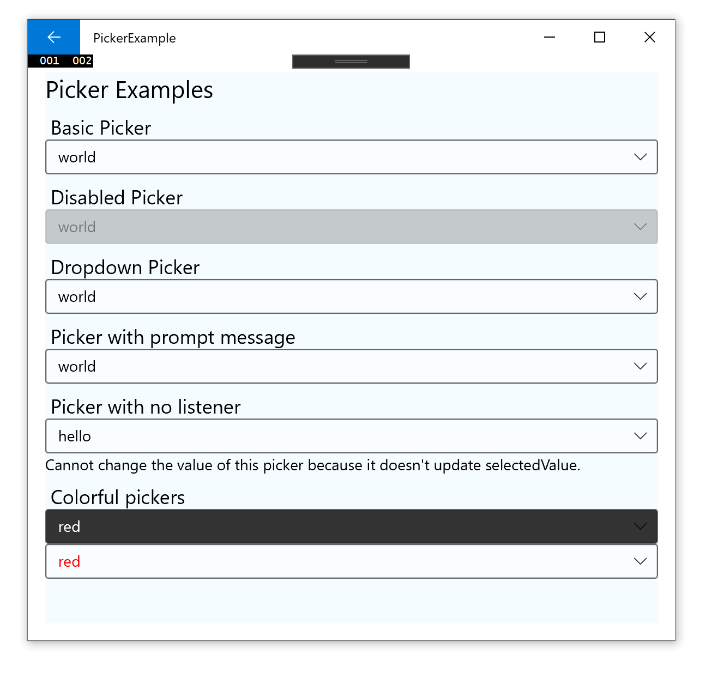
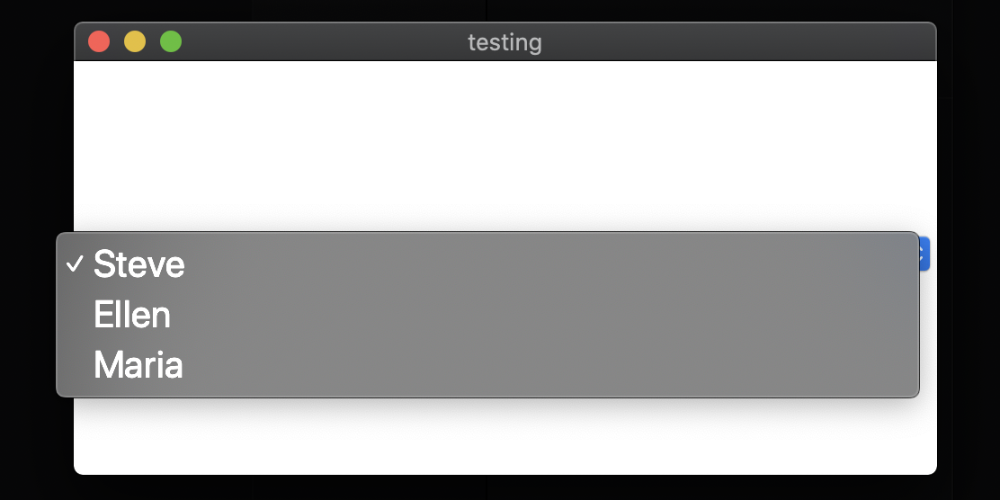

#  `@react-native-community/picker`

[](https://www.npmjs.com/package/@react-native-community/picker)
[](https://circleci.com/gh/react-native-community/workflows/react-native-picker/tree/master)   [](https://github.com/facebook/react-native/issues/23313)

| Android | iOS | PickerIOS | Windows | MacOS |
| --- | --- | --- | --- | --- |
|  |  |  |  | 

## Supported Versions

| @react-native-community/picker | react-native |
| --- | --- |
| >= 1.2.0 | 0.60+ or 0.59+ with [Jetifier](https://www.npmjs.com/package/jetifier) |
| >= 1.0.0 | 0.57 |

## For Managed Workflow users using Expo 37
This component is not supported in the managed workflow for expo sdk 37. Please import the `Picker` from `react-native`.
See more info [here](https://github.com/react-native-community/react-native-picker/issues/45#issuecomment-633163973)
   
## Getting started

`$ npm install @react-native-community/picker --save`

or

`$ yarn add @react-native-community/picker`

### For react-native@0.60.0 or above

As [react-native@0.60.0](https://reactnative.dev/blog/2019/07/03/version-60) or above supports autolinking, so there is no need to run linking process. 
Read more about autolinking [here](https://github.com/react-native-community/cli/blob/master/docs/autolinking.md).

#### iOS
CocoaPods on iOS needs this extra step

```
npx pod-install
```

#### Android
No additional step is required.

#### Windows
##### Add the `ReactNativePicker` project to your solution.

1. Open the solution in Visual Studio 2019
2. Right-click Solution icon in Solution Explorer > Add > Existing Project
   Select `D:\dev\RNTest\node_modules\@react-native-community\picker\windows\ReactNativePicker\ReactNativePicker.vcxproj`

##### **windows/myapp.sln**
Add a reference to `ReactNativePicker` to your main application project. From Visual Studio 2019:

Right-click main application project > Add > Reference...
  Check `ReactNativePicker` from Solution Projects.

##### **pch.h**

Add `#include "winrt/ReactNativePicker.h"`.

##### **app.cpp**

Add `PackageProviders().Append(winrt::ReactNativePicker::ReactPackageProvider());` before `InitializeComponent();`.

#### MacOS
CocoaPods on MacOS needs this extra step (called from the MacOS directory)

```
pod install
```


### Mostly automatic installation (react-native < 0.60)

`$ react-native link @react-native-community/picker`

### Manual installation (react-native < 0.60)


#### iOS

1. In XCode, in the project navigator, right click `Libraries` ➜ `Add Files to [your project's name]`
2. Go to `node_modules` ➜ ` @react-native-community/picker` and add `RNCPicker.xcodeproj`
3. In XCode, in the project navigator, select your project. Add `libRNCPicker.a` to your project's `Build Phases` ➜ `Link Binary With Libraries`
4. Run your project (`Cmd+R`)<

#### Android

1. Open **application** file (`android/app/src/main/java/[...]/MainApplication.java`)
  - Add `import com.reactnativecommunity.picker.RNCPickerPackage;` to the imports at the top of the file
  - Add `new RNCPickerPackage()` to the list returned by the `getPackages()` method
2. Append the following lines to `android/settings.gradle`:
  	```
  	include ': @react-native-community/picker'
  	project(': @react-native-community/picker').projectDir = new File(rootProject.projectDir, 	'../node_modules/@react-native-community/picker/android')
  	```
3. Insert the following lines inside the dependencies block in `android/app/build.gradle`:
  	```
      implementation project(path: ':@react-native-community_picker')
  	```
#### MacOS

1. In XCode, in the project navigator, right click `Libraries` ➜ `Add Files to [your project's name]`
2. Go to `node_modules` ➜ ` @react-native-community/picker` and add `RNCPicker.xcodeproj`
3. In XCode, in the project navigator, select your project. Add `libRNCPicker.a` to your project's `Build Phases` ➜ `Link Binary With Libraries`
4. Run your project (`Cmd+R`)<

## Usage
### Picker

Renders the native picker component on iOS and Android. Example:

#### Usage

Import Picker from `@react-native-community/picker`

```javascript
import {Picker} from '@react-native-community/picker';
```

Create state which will be used by the `Picker`

```javascript
state = {
  language: 'java',
};
```

Add `Picker` like this:
```javascript
<Picker
  selectedValue={this.state.language}
  style={{height: 50, width: 100}}
  onValueChange={(itemValue, itemIndex) =>
    this.setState({language: itemValue})
  }>
  <Picker.Item label="Java" value="java" />
  <Picker.Item label="JavaScript" value="js" />
</Picker>
```

### Props

* [Inherited `View` props...](https://reactnative.dev/docs/view#props)

- [`onValueChange`](#onvaluechange)
- [`selectedValue`](#selectedvalue)
- [`style`](#style)
- [`testID`](#testid)
- [`enabled`](#enabled)
- [`mode`](#mode)
- [`prompt`](#prompt)
- [`itemStyle`](#itemstyle)

---

# Reference

## Props

### `onValueChange`

Callback for when an item is selected. This is called with the following parameters:

* `itemValue`: the `value` prop of the item that was selected
* `itemPosition`: the index of the selected item in this picker

| Type     | Required |
| -------- | -------- |
| function | No       |

---

### `selectedValue`

Value matching value of one of the items. Can be a string or an integer.

| Type | Required |
| ---- | -------- |
| any  | No       |

---

### `style`

| Type            | Required |
| --------------- | -------- |
| pickerStyleType | No       |

---

### `testID`

Used to locate this view in end-to-end tests.

| Type   | Required |
| ------ | -------- |
| string | No       |

---

### `enabled`

If set to false, the picker will be disabled, i.e. the user will not be able to make a selection.

| Type | Required | Platform |
| ---- | -------- | -------- |
| bool | No       | Android, Windows  |

---

### `mode`

On Android, specifies how to display the selection items when the user taps on the picker:

* 'dialog': Show a modal dialog. This is the default.
* 'dropdown': Shows a dropdown anchored to the picker view

| Type                       | Required | Platform |
| -------------------------- | -------- | -------- |
| enum('dialog', 'dropdown') | No       | Android  |

---

### `prompt`

Prompt string for this picker, used on Android in dialog mode as the title of the dialog.

| Type   | Required | Platform |
| ------ | -------- | -------- |
| string | No       | Android  |

---

### `itemStyle`

Style to apply to each of the item labels.

| Type                               | Required | Platform |
| ---------------------------------- | -------- | -------- |
| [text styles](https://reactnative.dev/docs/text-style-props) | No       | iOS, Windows      |

### PickerIOS
### Props

* [Inherited `View` props...](https://reactnative.dev/docs/view#props)

- [`itemStyle`](#itemstyle)
- [`onValueChange`](#onvaluechange)
- [`selectedValue`](#selectedvalue)

---

# Reference

## Props

### `itemStyle`

| Type                               | Required |
| ---------------------------------- | -------- |
| [text styles](https://reactnative.dev/docs/text-style-props) | No       |

---

### `onValueChange`

| Type     | Required |
| -------- | -------- |
| function | No       |

---

### `selectedValue`

| Type | Required |
| ---- | -------- |
| any  | No       |

  
